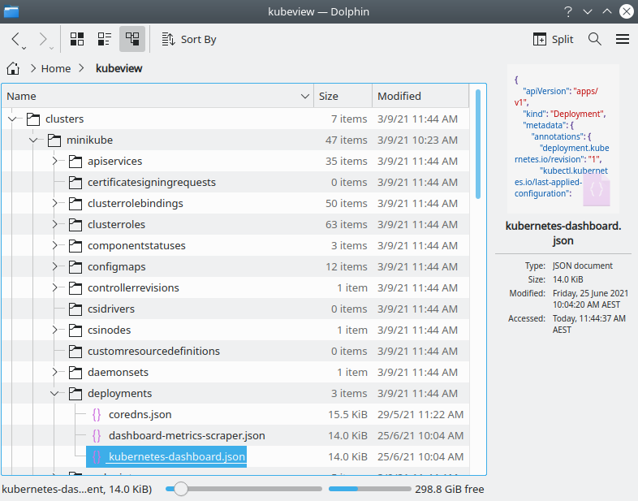

# 

This project is a collection of tools created to demystify your kubernetes
clusters and make them more accessible to non-expert users.

* `kubefs` is a filesystem that allows you to browse the kubernetes objects in
  your cluster in a familiar way, as files and directories.
* `podview` is a terminal program which gives you a real time view of pods that
  interest you, across clusters. You can use it to watch code deployments in
  real time, or check up on the health of your workloads.


## kubefs - a fuse filesystem for browsing k8s clusters

`kubefs` is a **read-only** filesystem that runs in user space (you don't need
to be `root` to mount it) that allows you to browse objects in your Kubernetes
clusters.



It loads your kube config(s) from `$KUBECONFIG` or `~/.kube` and uses that to
present a top level view for you to navigate:

```bash
$ ls -p ~/kubeview
clusters/
contexts/
users/
```

You can use this to explore the cluster:

```bash
$ ls -p ~/kubeview/clusters
minikube/

$ ls -p ~/kubeview/clusters/minikube
configmaps/
deployments/
endpoints/
namespaces/
nodes/
pods/
replicasets/
secrets/
services/

$ ls -p ~/kubeview/clusters/minikube/pods
coredns-74ff55c5b-xd6nf
etcd-minikube
kube-apiserver-minikube
kube-controller-manager-minikube
kube-proxy-66s6j
kube-scheduler-minikube
storage-provisioner

$ head ~/kubeview/clusters/minikube/pods/etcd-minikube
{
    "api_version": "v1",
    "kind": "Pod",
    "metadata": {
        "annotations": {
...
```

Behind the scenes, `kubefs` makes requests to the k8s API server to fetch all
these objects and populate the filesystem. This can be slow, so directory
entries are cached.


### Quickstart

`kubefs` requires a few libraries to run. The script `kfs` sets all this up on
the first run, so that's all you need. `kubefs` runs in the foreground, so once
you launch it it mounts the filesystem and keeps running until you stop it.
When you stop it, the filesystem is umounted.

Mounting the filesystem:

```bash
# create a mount point
$ mkdir ~/kubeview

# mount the filesystem there
$ ./kfs ~/kubeview
Re-using existing virtualenv at: .ve/ and assuming it's up to date.
If you see errors try 'rm -rf .ve/' and re-run this script.
DEBUG:fuse.log-mixin:-> init / ()
DEBUG:fuse.log-mixin:<- init None
```


## podview

`podview` is a curses based terminal program which gives you a real time view of the
pods that you want to see.

It loads your kube config(s) from `$KUBECONFIG` or `~/.kube` and uses that to
detect all your clusters. You can then filter on:

* cluster name using `-c` / `--cluster`
* namespace name using `-n` / `--namespace`
* pod name using `-p` / `--pod`

A very common case is watching the state of pods for a particular
workload/service across all your clusters:

```bash
$ ./pv --namespace 'istio*' --pod 'prom*'
```


