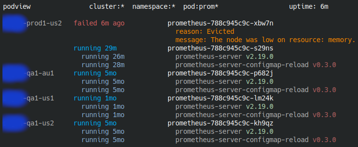

# User friendly kubernetes tools

This project is a collection of tools created to demystify your kubernetes
clusters and make them more accessible to non-expert users.

* `kubefs` is a filesystem that allows you to browse the kubernetes objects in
  your cluster in a familiar way, as files and directories.
* `podview` is a terminal program which gives you a real time view of pods that
  interest you, across clusters. You can use it to watch code deployments in
  real time, or check up on the health of your workloads.


## kubefs - a fuse filesystem for browsing clusters

`kubefs` is a **read-only** filesystem that runs in user space (you don't need
to be `root` to mount it) that allows you to browse objects in your Kubernetes
clusters.


It loads your kube config(s) from `$KUBECONFIG` or `~/.kube` and uses that to
present a top level view for you to navigate. The modification timestamps of the
files and directories reflect the `creationTimestamp` of the kube objects
themselves.

Behind the scenes, `kubefs` makes requests to the k8s API server to fetch all
these objects and populate the filesystem. This can be slow, so directory
entries are cached.


## podview - a real time dashboard for pods

`podview` is a curses based terminal program which gives you a real time view of the
pods that you want to see.

It loads your kube config(s) from `$KUBECONFIG` or `~/.kube` and uses that to
detect all your clusters. You can then filter on:

* cluster name using `-c` / `--cluster`
* namespace name using `-n` / `--namespace`
* pod name using `-p` / `--pod`

A very common case is watching the state of pods for a particular
workload/service across all your clusters:

```bash
$ ./pv --pod 'prom*'
```



On startup `podview` first lists all the pods matching your filter, and then
proceeds to watch them for updates.

Pods are listed per cluster, and sorted by `creationTimestamp` so you will see
the oldest pods at the top.

Keyboard controls:

* Arrow keys to scroll horizontally or vertically by one character.
* PageUp/PageDown to scroll vertically by half a page.


## logview - a real time dashboard for pods

### Use case: All pods in cluster where container name matches

```bash
$ ./lv -c cluster1 --cont *istio*
```


## Getting started

Requirements:
​
* Python 3.8 or later.
* A working kube config (make sure `kubectl` works).
* Additional dependencies for `kubefs` (not required for `podview`):
  * `fuse` (available on Linux and [Mac](https://osxfuse.github.io/))
  * Somewhere to mount the filesystem. `~/kubeview` is the suggested mount
    point, but you can use any location you like.


### Ubuntu


#### System packages

Let's first check the version of your system Python:

```bash
$ python3 -V
Python 3.8.10
```

Install the fuse packages and the python-venv package matching your installed
version:

```bash
$ sudo apt install fuse libfuse2 python3.8-venv
```


### Project setup (the scripted way)

Clone the repository:

```bash
$ git clone https://github.com/nearmap/kubefs
$ cd kubefs
```

These scripts automate the manual setup below:

```bash
# kubefs
$ mkdir -p ~/kubeview
$ ./kfs ~/kubeview

# podview
$ ./pv
```

They basically manage the virtual environment for you, so *they have to be run
outside of the virtual environment*.

The scripts assume that you either:
- Don't have a virtual environment in `.ve/` at all (it will setup it up for
  you), or
- You have a fully populated virtual environment in `.ve/` (it will assume it's
  up to date to avoid running `pip install` every time).

If your virtual environment isn't working try removing it by doing `rm -rf .ve`
and re-running the scripts. See also the `Troubleshooting` section below.


### Project setup (the manual way)

Clone the repository:

```bash
$ git clone https://github.com/nearmap/kubefs
$ cd kubefs
```

Create the virtual environment by doing:

```bash
$ python3 -m venv .ve
```

Activate it by doing:

```bash
$ . .ve/bin/activate
(.ve) $
```

Once you've activated the virtual environment install the dependencies into it:

```bash
(.ve) $ pip install -r requirements.txt
```

Finally, make sure kubefs and podview can be started without errors:

```bash
# kubefs
(.ve) $ mkdir -p ~/kubeview
(.ve) $ bin/kubefs ~/kubeview

# podview
(.ve) $ bin/podview
```


### Troubleshooting

**When running `kubefs` or `podview` I get `ModuleNotFoundError: No module named
'fuse'`**

Your virtual environment is missing one or more dependencies. Try re-creating
it and re-installing the dependencies. See the `Project setup` steps above.

**While creating/installing dependencies into a virtual environment I see
errors in red, something about `Failed building wheel`.**

These are not fatal errors and you can ignore them.

**When running `kubefs` or `podview` I get `FileNotFoundError: [Error 2] No such
file or directory: '/home/user/.kube'`.**

Your kube config files could not be detected. (Does `kubectl` work?)

If you have `$KUBECONFIG` set make sure it's pointing at one or more valid kube
config files, eg.
`KUBECONFIG=/home/user/.kube/cluster1:/home/user/.kube/cluster2`.

Otherwise, make sure that your `~/.kube` directory contains at least one valid
kube config file.

**Using logs to troubleshoot problems that occur at runtime.**

`kubefs` runs in the foreground and logs to stdout/stderr.

`podview` runs a curses ui in the foreground. It logs to `var/log/podview.log`.
